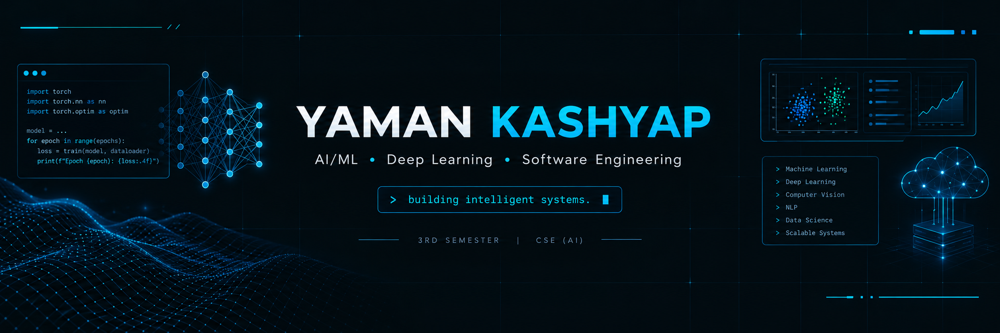

<p align="center">
  
</p>

<h1 align="center">Hi, I'm Yaman Kashyap 👋</h1>

<p align="center">
  <b>AI/ML Developer • Deep Learning Enthusiast • Software Engineer</b>
</p>

<p align="center">
  <a href="https://github.com/yamankashyap2912">
    
  </a>
  <a href="https://github.com/yamankashyap2912">
    
  </a>
</p>

---

## 👨‍💻 About Me

🎓 CSE (AI) student at **IIIT Bhopal**

🤖 Passionate about **Artificial Intelligence, Machine Learning & Deep Learning**

🔬 Interested in **AI Research, Computer Vision, NLP and intelligent systems**

🚀 Building practical AI/ML projects that solve real-world problems

💻 Currently improving **DSA, Deep Learning and Software Engineering**

📚 Exploring **PyTorch, Transformers, Computer Vision and AI Agents**

---

## 🧠 Tech Stack

### Programming

<p>

</p>

### AI / Machine Learning

<p>

</p>

`Machine Learning` • `Deep Learning` • `Computer Vision` • `NLP`

### Development

<p>

</p>

---

# 🚀 Featured Projects

### 🌩️ RISORA — Thunderstorm Nowcasting

AI/ML based thunderstorm and lightning nowcasting platform using atmospheric observations, radar, satellite and model data.

**Tech:** Python • Machine Learning • Deep Learning • Weather Data

🔗 [View Project](https://github.com/yamankashyap2912/risora-thunderstorm-nowcasting)

---

### 🛰️ SatQuery AI

Multimodal remote-sensing AI system combining satellite imagery with natural-language interaction.

**Tech:** Python • AI • Remote Sensing • Satellite Data

🔗 [View Project](https://github.com/yamankashyap2912/Satquery_AI_v1)

---

### 🚦 Traffic Violation Predictor

Machine-learning system for predicting traffic violation severity, risk score and fine-payment likelihood.

**Tech:** Python • PyTorch • FastAPI • Streamlit

🔗 [View Project](https://github.com/yamankashyap2912/traffic-violation-predictor)

---

### 🗄️ TNP Placement Engine

Database management system project designed for managing placement and recruitment workflows.

**Tech:** Python • SQL • DBMS

🔗 [View Project](https://github.com/yamankashyap2912/tnp-placement-engine)

---

## 📊 GitHub Statistics

<p align="center">
  
  
</p>

---

## 📈 Contribution Graph

<p align="center">
  
</p>

---

## 🎯 Current Focus

```text
Machine Learning       ████████████████░░░░
Deep Learning          ██████████████░░░░░░
DSA                    ████████████░░░░░░░░
Computer Vision        ██████████░░░░░░░░░░
Transformers / NLP     ████████░░░░░░░░░░░░
AI Agents              ███████░░░░░░░░░░░░░
